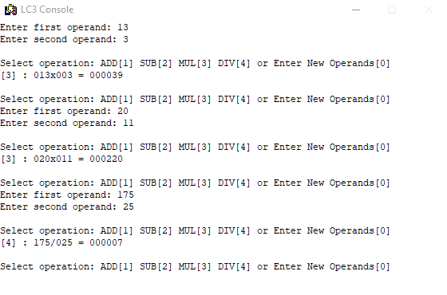

# Calculator
> A Simple Calculator program written in Assembley for the LC3 Computer

A Calculator program that adds, subtracts, multiplies, or divides operands of up to three digits.


## LC3 Von Neumann Architecture

Little Computer 3, or LC-3, is a type of computer educational programming language, an assembly language, which is a type of low-level programming language. It features a relatively simple instruction set, but can be used to write moderately complex assembly programs, and is a viable target for a C compiler.
[Wikipedia](https://en.wikipedia.org/wiki/Little_Computer_3)

## Installation

1. Run the LC3 Simulator by launching ```simulate.exe``` found in the *LC3 Program Folder*
2. Load the Calculator program into the simulator by going to ```File > Load Program```
3. Run the Calculator program by going to ```Execute > Run```


## Usage example

<div align="center">
  <a href="https://github.com/SimpleLogix/Calculator">
    
  </a>
  
   <br/>
    <figcaption align = "center"><b>Fig.1 - LC3 Simulator Console Running my Calc Program </b></figcaption>
  
</div>
<br/><br/>


## Contact

Your Name – [@SimpleLogix](https://github.com/SimpleLogix) – harkouswalid@gmail.com

Distributed under the MIT license. See ``LICENSE`` for more information.

[https://github.com/yourname/github-link](https://github.com/dbader/)
